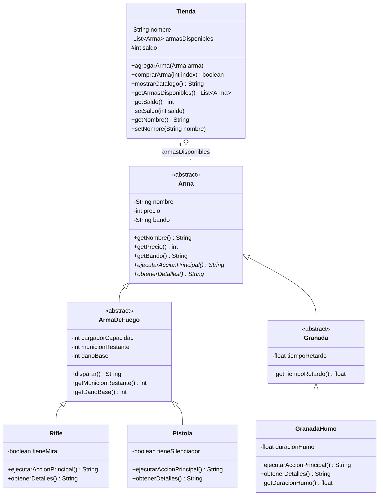

# Taller de GIT + Práctica POO & API REST (CS2)

**Asignatura:** CYT646 — Lenguaje de Programación 3
**Edición:** 2026
**Alumno:** Ariel Gaona
**Dominio seleccionado:** Opción B — Counter-Strike 2
**Licencia:** Apache License 2.0

---

## 📌 Descripción del Proyecto

Este repositorio contiene la implementación de una API REST desarrollada con **Spring Boot 3** y **Java 21**, utilizando **Maven** y **Spring Web**.

El proyecto modela diferentes tipos de armas del videojuego **Counter-Strike 2**, aplicando los principales conceptos de Programación Orientada a Objetos trabajados durante la asignatura.

### Conceptos de POO aplicados

* **Encapsulamiento y ocultamiento de información:** los atributos del dominio permanecen ocultos mediante modificadores de acceso como `private`. El estado de los objetos se modifica mediante métodos de dominio.
* **Herencia:** se utiliza una jerarquía de clases partiendo de la clase abstracta `Arma`.
* **Generalización:** `ArmaDeFuego` y `Granada` representan especializaciones intermedias del dominio.
* **Sobreescritura:** las clases concretas implementan el comportamiento definido por la clase base.
* **Polimorfismo:** los objetos pueden ser tratados mediante el tipo general `Arma`, permitiendo solicitar su comportamiento sin depender de comprobaciones del tipo concreto.
* **Abstracción:** `Arma` define comportamientos comunes mediante métodos abstractos que deben ser implementados por las clases concretas.

---

## 🛠️ Tecnologías

* **Java 21**
* **Spring Boot 3**
* **Spring Web**
* **Maven**
* **Git / GitHub**
* **Mermaid** para el diagrama de clases

---

## 📁 Estructura principal

```text
src/
└── main/
    └── java/
        └── py/
            └── edu/
                └── uc/
                    └── lp3/
                        ├── ag/
                        │   └── cs2/
                        │       ├── Arma.java
                        │       ├── ArmaDeFuego.java
                        │       ├── Granada.java
                        │       ├── Rifle.java
                        │       ├── Pistola.java
                        │       └── GranadaHumo.java
                        │
                        └── web/
                            └── Controllers
```

> La estructura puede variar ligeramente según la organización final de los paquetes del proyecto.

---

## ▶️ Ejecución del proyecto

### Requisitos

* Java JDK 21
* Maven incluido mediante Maven Wrapper

### Compilar

En Linux/macOS:

```bash
./mvnw -q compile
```

En Windows:

```bash
mvnw.cmd -q compile
```

### Ejecutar la aplicación

En Linux/macOS:

```bash
./mvnw spring-boot:run
```

En Windows:

```bash
mvnw.cmd spring-boot:run
```

Una vez iniciada la aplicación, el servidor queda disponible en:

```text
http://localhost:8080
```

---

## 🌐 API REST

### `GET /`

Endpoint utilizado para comprobar que el servicio está funcionando correctamente.

```text
GET http://localhost:8080/
```

El `IndexController` se encarga de responder a esta petición y confirmar que la API se encuentra activa.

### Controller de construcción

La API también cuenta con un controller que recibe parámetros mediante `@RequestParam` para construir objetos del dominio.

Los valores recibidos desde HTTP son enviados al constructor o método correspondiente del modelo. Las reglas de validez pertenecen a las clases del dominio y no al controller.

### Comportamiento polimórfico

El proyecto utiliza un controller REST para solicitar el comportamiento de las distintas armas mediante una referencia al tipo base `Arma`.

El controller no necesita implementar una cadena de condiciones para determinar cómo debe comportarse cada arma. Cada objeto concreto proporciona su propia implementación del método abstracto definido en `Arma`.

La respuesta del endpoint se presenta en formato **JSON**.

---

## 📐 Diagrama de Clases

El siguiente diagrama representa el modelo de clases desarrollado para el dominio de **Counter-Strike 2**, correspondiente al modelado trabajado en POO-02 y POO-03.



---

## 🧩 Aplicación del Polimorfismo

La clase `Arma` define el contrato común mediante métodos abstractos:

```java
public abstract String ejecutarAccionPrincipal();

public abstract String obtenerDetalles();
```

Las clases concretas proporcionan su propia implementación.

Por ejemplo:

* `Rifle` implementa el comportamiento correspondiente a un rifle.
* `Pistola` implementa el comportamiento correspondiente a una pistola.
* `GranadaHumo` implementa el comportamiento correspondiente a una granada de humo.

De esta manera, el código que utiliza las armas puede trabajar con una referencia de tipo `Arma` sin necesitar conocer directamente la clase concreta.

```java
Arma arma = ...;

String resultado = arma.ejecutarAccionPrincipal();
```

El método que se ejecuta depende del objeto concreto recibido, demostrando **polimorfismo mediante sobreescritura**.

---

## 🧪 Verificación

Antes de realizar el commit final se puede verificar que el proyecto compile correctamente:

```bash
./mvnw -q compile
```

Y posteriormente iniciar la aplicación:

```bash
./mvnw spring-boot:run
```

Finalmente, se puede comprobar el funcionamiento básico de la API accediendo a:

```text
http://localhost:8080/
```

---

## 📚 Objetivos de la práctica

Este proyecto integra los siguientes contenidos trabajados en la asignatura:

* Uso de Git y GitHub.
* Organización de un proyecto Java mediante Maven.
* Integración de Spring Boot.
* Desarrollo de una API REST.
* Encapsulamiento.
* Ocultamiento de información.
* Herencia.
* Abstracción.
* Sobreescritura de métodos.
* Polimorfismo.
* Separación entre la capa HTTP y las reglas del dominio.
* Representación del modelo mediante diagramas Mermaid.

---
