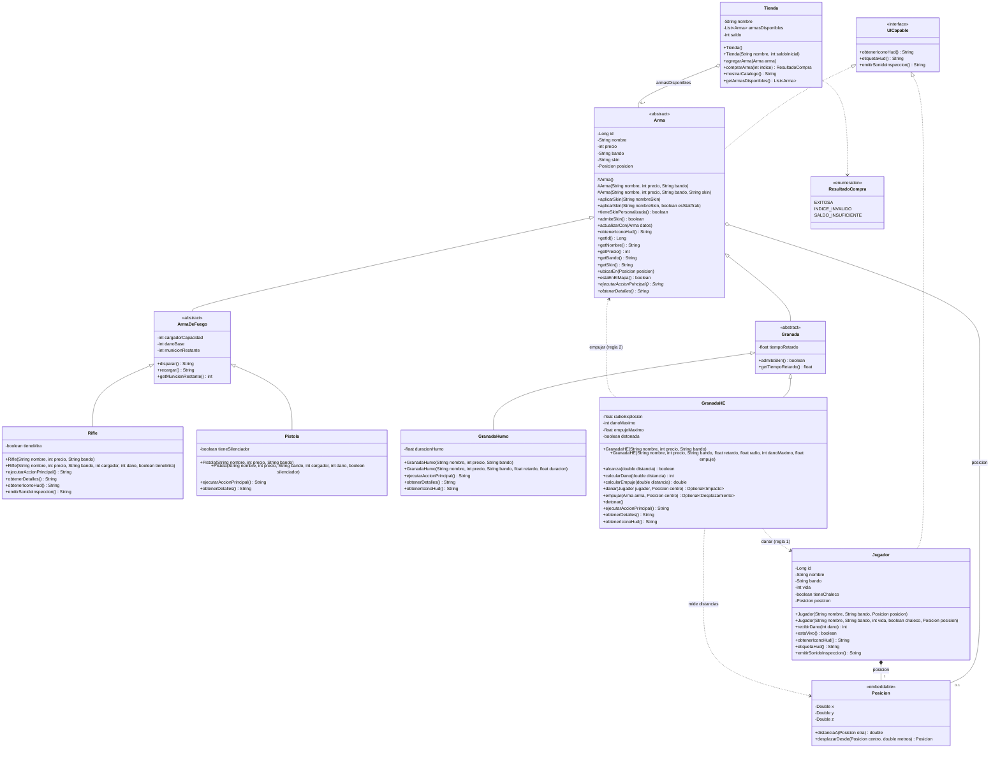
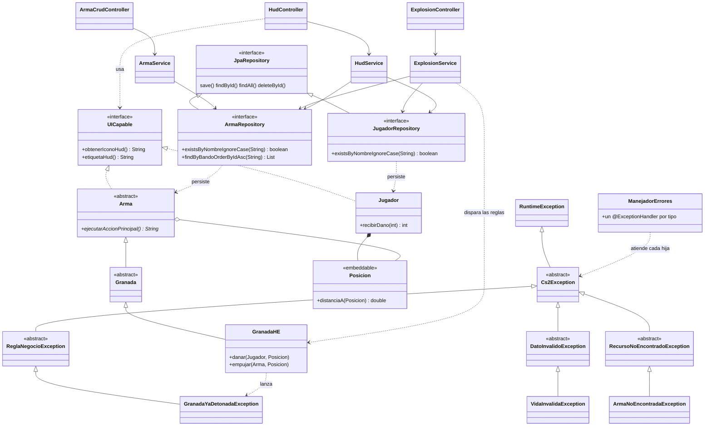

# Taller de GIT + Práctica POO & API REST (CS2)

**Asignatura:** CYT646 — Lenguaje de Programación 3  
**Edición:** 2026  
**Alumno:** Ariel Gaona  
**Dominio seleccionado:** Opción B — Counter-Strike 2  
**Licencia:** Apache License 2.0  

### 🔗 Commit de la entrega (Ejercicio POO-08 — CRUD, H2 e Insomnia)

_Pendiente: se completa con el enlace al commit de la solución._

Las especificaciones aplicadas a este dominio están en [`docs/especificaciones-poo-08.md`](docs/especificaciones-poo-08.md).

### 🔗 Commit de la entrega (Ejercicio POO-06)

https://github.com/ferue/agaona-taller-git-2026/commit/4fae9d253e3a9f7961eee31320f8a42ea60ff53a

Este commit tiene la solución completa: el código, los tests, este README y la bitácora. El commit posterior solo agrega este enlace.

---

## 📌 Descripción del Proyecto

Este repositorio contiene una API REST desarrollada con **Spring Boot 4.1** y **Java 21**, usando **Maven**, **Spring Web MVC** y **Spring Data JPA** con una base de datos **H2**.

El proyecto modela armas y la tienda (buy menu) del videojuego **Counter-Strike 2**, aplicando los conceptos de Programación Orientada a Objetos trabajados en la asignatura.

### 🎯 Las dos reglas de negocio

1. **Daño de la explosión:** una granada HE daña a todos los jugadores vivos dentro de su radio, aliados incluidos; el daño baja con la distancia y el chaleco lo reduce a la mitad.
2. **Empuje de armas:** toda arma tirada en el mapa dentro del radio sale despedida en dirección contraria a la explosión, y vuela más lejos cuanto más cerca estaba.

Cada regla es un mensaje de `GranadaHE` (`danar(jugador, centro)` y `empujar(arma, centro)`), se dispara con `POST /api/explosiones` y en ella participan tres clases del modelo: `GranadaHE`, `Jugador` y `Posicion`. Ver [Simulación de explosiones](#-simulación-de-explosiones-granada-he).

### Conceptos de POO aplicados

* **Encapsulamiento y ocultamiento de información:** todos los atributos son `private` y no hay setters. La skin solo cambia mediante `aplicarSkin(...)`, la munición solo con `disparar()` / `recargar()` y los datos de un arma guardada solo con `actualizarCon(...)`. Desde que las armas son entidades JPA los atributos ya no son `final`, porque Hibernate los completa al leer de la base.
* **Invariantes:** los constructores validan los datos y, si son inválidos, lanzan una excepción propia de la rama `DatoInvalidoException` (`PrecioNegativoException`, `CampoObligatorioException`, `CargadorInvalidoException`, etc.). La tienda nunca queda con saldo negativo y su catálogo se expone como lista de solo lectura.
* **Herencia y generalización:** `Arma` (abstracta) → `ArmaDeFuego` / `Granada` (abstractas) → `Rifle`, `Pistola`, `GranadaHumo`, `GranadaHE`. La misma jerarquía se persiste con `@Inheritance(strategy = JOINED)`. Las excepciones también forman una jerarquía con raíz `Cs2Exception`.
* **Sobrecarga (overloading):** constructores con distintas firmas en `Arma`, `Rifle`, `Pistola`, `GranadaHumo` y `Tienda`; métodos `aplicarSkin(String)` / `aplicarSkin(String, boolean)` y `FabricaArmas.crear(...)` con dos firmas.
* **Sobrescritura (overriding):** las clases concretas implementan `ejecutarAccionPrincipal()` y `obtenerDetalles()` con `@Override`; `Rifle` y `GranadaHumo` redefinen `obtenerIconoHud()` y `Rifle` redefine el método `default` `emitirSonidoInspeccion()` de `UICapable`.
* **Polimorfismo:** los controladores trabajan con `Arma` o `UICapable` sin preguntar por la clase concreta (`/api/armas/polimorfismo`, `/ui/{nombre}`, `/api/hud`).
* **Abstracción:** `Arma`, `ArmaDeFuego` y `Granada` son abstractas; `UICapable` es una interfaz con dos métodos abstractos y uno `default`, implementada por dos familias distintas: `Arma` y `Jugador`.
* **Objeto valor:** `Posicion` no tiene id ni setters; moverla (`desplazarDesde(...)`) devuelve una posición nueva.

---

## 🛠️ Tecnologías

* **Java 21**
* **Spring Boot 4.1** (Spring Web MVC)
* **Spring Data JPA** (Hibernate) y **H2 Database**
* **Insomnia** para probar el CRUD
* **Maven** (con Maven Wrapper)
* **JUnit 5**
* **Git / GitHub**
* **Mermaid** para el diagrama de clases

---

## 📁 Estructura principal

```text
cs2/
├── pom.xml
└── src/
    ├── main/java/py/edu/uc/lp3/ag/cs2/
    │   ├── Cs2Application.java
    │   ├── domain/                      ← modelo de dominio (POO + entidades JPA)
    │   │   ├── UICapable.java
    │   │   ├── Arma.java
    │   │   ├── ArmaDeFuego.java
    │   │   ├── Granada.java
    │   │   ├── Rifle.java
    │   │   ├── Pistola.java
    │   │   ├── GranadaHumo.java
    │   │   ├── GranadaHE.java           ← granada explosiva (simulación)
    │   │   ├── Jugador.java             ← jugador con vida, chaleco y posición
    │   │   ├── Posicion.java            ← punto x, y, z (@Embeddable)
    │   │   ├── Tienda.java
    │   │   └── ResultadoCompra.java
    │   ├── exception/                   ← jerarquía de excepciones
    │   │   ├── Cs2Exception.java        ← raíz
    │   │   ├── validacion/              ← DatoInvalidoException y 13 hijas (400)
    │   │   ├── noencontrado/            ← RecursoNoEncontradoException y 4 hijas (404)
    │   │   └── negocio/                 ← ReglaNegocioException y 9 hijas (400 / 409)
    │   ├── config/
    │   │   └── CargaInicialArmas.java   ← catálogo y escenario de explosión de ejemplo
    │   ├── repository/                  ← capa de datos (interfaces)
    │   │   ├── ArmaRepository.java
    │   │   └── JugadorRepository.java
    │   ├── service/                     ← capa de negocio
    │   │   ├── HudService.java          ← junta armas y jugadores como UICapable
    │   │   ├── ArmaService.java         ← CRUD de armas + reglas del catálogo
    │   │   ├── JugadorService.java
    │   │   ├── ExplosionService.java    ← las dos reglas de la simulación
    │   │   ├── ResultadoExplosion.java
    │   │   └── FabricaArmas.java        ← crea armas a partir del "tipo"
    │   └── rest/                        ← capa web
    │       ├── ManejadorErrores.java    ← un @ExceptionHandler por cada excepción
    │       ├── controller/
    │       │   ├── IndexController.java
    │       │   ├── ArmaController.java
    │       │   ├── ArmaCrudController.java   ← CRUD /api/armas
    │       │   ├── JugadorController.java    ← /api/jugadores
    │       │   ├── ExplosionController.java  ← /api/explosiones
    │       │   ├── HudController.java        ← /api/hud (usa la interfaz UICapable)
    │       │   ├── TiendaController.java
    │       │   └── UIController.java
    │       ├── request/
    │       │   ├── ArmaRequest.java
    │       │   ├── JugadorRequest.java
    │       │   ├── ExplosionRequest.java
    │       │   └── PosicionRequest.java
    │       └── response/
    │           ├── ArmaResponse.java
    │           ├── ArmaGuardadaResponse.java
    │           ├── JugadorResponse.java
    │           ├── ExplosionResponse.java
    │           ├── HudElementoResponse.java
    │           ├── PosicionResponse.java
    │           ├── ErrorResponse.java
    │           └── UIElementResponse.java
    ├── main/resources/application.properties ← H2 + JPA
    ├── test/resources/application.properties ← H2 en memoria para los tests
    └── test/java/py/edu/uc/lp3/ag/cs2/
        ├── Cs2ApplicationTests.java
        ├── domain/
        │   ├── ArmaTest.java
        │   ├── ArmaDeFuegoTest.java
        │   ├── TiendaTest.java
        │   ├── PosicionTest.java
        │   ├── GranadaHETest.java
        │   └── JugadorTest.java
        ├── service/
        │   ├── ArmaServiceTest.java
        │   ├── JugadorServiceTest.java
        │   └── ExplosionServiceTest.java
        └── rest/
            ├── ManejadorErroresTest.java     ← comprueba que no falte ningún handler
            └── controller/
                ├── ArmaCrudControllerTest.java
                ├── HudControllerTest.java
                └── ControladoresTest.java
insomnia/
└── cs2-armas-crud.json                  ← colección para importar en Insomnia
docs/
├── especificaciones-poo-08.md           ← especificaciones para Classroom
└── especificaciones-poo-08.pdf
```

---

## ▶️ Ejecución del proyecto

### Requisitos

* Java JDK 21
* Maven incluido mediante Maven Wrapper (no hace falta instalarlo)

Todos los comandos se ejecutan dentro de la carpeta `cs2/`.

### Compilar

```bash
./mvnw -q compile        # Linux / macOS
mvnw.cmd -q compile      # Windows
```

### Ejecutar los tests

```bash
./mvnw test              # Linux / macOS
mvnw.cmd test            # Windows
```

### Ejecutar la aplicación

```bash
./mvnw spring-boot:run       # Linux / macOS
.\mvnw.cmd spring-boot:run   # Windows (PowerShell necesita el .\ delante)
```

El servidor queda disponible en `http://localhost:8080`.

### Recorrido rápido (POO-08)

1. Si ya habías arrancado la app antes, apagala y borrá la carpeta `cs2/data` para empezar con la base limpia.
2. Arrancá con `./mvnw spring-boot:run`. Al iniciar se cargan 5 armas de catálogo y el escenario de la explosión (una granada HE, 4 jugadores y 3 armas tiradas en el mapa).
3. `GET http://localhost:8080/` confirma que el servicio vive y lista los endpoints.
4. Importá la colección de Insomnia y recorré las carpetas en orden (ver [Colección de Insomnia](#colección-de-insomnia)).
5. Abrí `http://localhost:8080/h2-console` para ver las tablas (datos de conexión en [Base de datos H2](#base-de-datos-h2)).

---

## 🌐 API REST

Errores: cada error tiene su propia excepción (ver [Jerarquía de excepciones](#-jerarquía-de-excepciones)). Los datos inválidos responden **400**, los recursos inexistentes **404** y los conflictos (nombre repetido, granada ya detonada) **409**, siempre con un JSON de la forma:

```json
{ "status": 404, "error": "Not Found", "tipo": "TiendaNoEncontradaException", "mensaje": "Tienda no encontrada: tienda-9" }
```

### `GET /`
Comprueba que el servicio funciona y lista los endpoints disponibles.

### `GET /api/armas/probar`
Construye un arma y ejecuta su acción principal. Parámetros (todos opcionales): `tipo` (`rifle`, `pistola`, `granada-humo`), `nombre`, `precio`, `bando`, `skin`, `statTrak`.

Si llega `skin` se usa `aplicarSkin(String)`; si además llega `statTrak` se usa la sobrecarga `aplicarSkin(String, boolean)`.

```bash
curl "http://localhost:8080/api/armas/probar?tipo=rifle&nombre=AK-47&precio=2700&bando=T&skin=Asiimov&statTrak=true"
```
```json
{
  "arma": {
    "tipo": "Rifle", "nombre": "AK-47", "precio": 2700, "bando": "T",
    "skin": "StatTrak™ Asiimov",
    "detalles": "Rifle AK-47 | Daño: 36 | Cargador: 30",
    "iconoHud": "ui/hud/icons/rifle.png"
  },
  "resultadoAccion": "¡PUM! Disparo efectuado con AK-47. Munición restante: 29"
}
```

Con `precio=-100` o `tipo=escopeta` responde **400**.

### `GET /api/armas/rafaga`
Dispara `disparos` veces (1 a 100) con un arma de fuego y luego recarga, mostrando cómo cambia la munición.

```bash
curl "http://localhost:8080/api/armas/rafaga?tipo=pistola&disparos=3"
```
Respuesta (resumida): `disparos` con 3 mensajes (munición 11, 10, 9), `municionAntesDeRecargar: 9`, `recarga: "Recargando PISTOLA... Munición: 12/12"`, `municionFinal: 12`.

### `GET /api/armas/polimorfismo`
Recorre una `List<Arma>` (rifle, pistola y granada de humo) y llama a los mismos métodos en cada una; cada clase responde con su propia sobrescritura.

### Tienda

| Método y ruta | Descripción | Respuestas |
|---|---|---|
| `POST /tienda?nombre=CT&saldo=5000` | Crea una tienda | 201 |
| `POST /tienda/{id}/agregar-arma?tipo=rifle&nombre=M4A1-S&precio=2900&bando=CT` | Agrega un arma (opcionales: `cargadorCapacidad`, `danoBase`, `atributoEspecial`) | 201 · 400 tipo/datos inválidos · 404 |
| `GET /tienda/{id}/catalogo` | Lista las armas y el saldo | 200 · 404 |
| `POST /tienda/{id}/comprar?indiceArma=0` | Compra el arma de esa posición | 200 · 400 índice inválido · 409 saldo insuficiente · 404 |

```bash
curl -X POST "http://localhost:8080/tienda?nombre=CT&saldo=5000"
# {"id":"tienda-0","nombre":"CT","saldo":5000,"armasEnInventario":0}

curl -X POST "http://localhost:8080/tienda/tienda-0/agregar-arma?tipo=rifle&nombre=M4A1-S&precio=2900&bando=CT&cargadorCapacidad=25&danoBase=38&atributoEspecial=true"

curl -X POST "http://localhost:8080/tienda/tienda-0/comprar?indiceArma=0"
# {"tienda":"CT","resultado":"EXITOSA","mensaje":"Compra realizada","saldoRestante":2100,"armasRestantes":0}
```

### `GET /ui/{nombre}`
Devuelve el elemento de HUD de un arma (`ak47`/`rifle`, `usp`/`pistola`, `smoke`/`humo`). El controlador solo conoce la interfaz `UICapable`. Un nombre inexistente responde **404**.

```bash
curl "http://localhost:8080/ui/ak47"
# {"tipo":"Rifle","imagen":"ui/hud/icons/rifle.png","posicion":"HUD_SLOT_PRINCIPAL",
#  "sonido":"clack-clack_metalico_rifle.wav","velocidad":200.0,"mensaje":"Cargado correctamente para CS2"}
```

---

## 💾 CRUD de Armas con persistencia (H2 + Spring Data JPA)

El CRUD trabaja sobre la raíz abstracta `Arma`, así que guarda y devuelve cualquier tipo concreto (`Rifle`, `Pistola`, `GranadaHumo`, `GranadaHE`).

### Arquitectura en 3 capas

```text
HTTP (JSON)
   │
   ▼
ArmaCrudController   rest/controller   → convierte JSON ↔ objetos, sin lógica de negocio
   │  ArmaRequest.aDominio() usa FabricaArmas y los constructores validan las invariantes
   ▼
ArmaService          service           → reglas de negocio + @Transactional
   │
   ▼
ArmaRepository       repository        → interfaz JpaRepository<Arma, Long>; Spring genera la implementación
   │
   ▼
H2 (archivo cs2/data/cs2db.mv.db)
```

Cada capa solo conoce a la de abajo. El controlador recibe el service por constructor y el service recibe la **interfaz** del repositorio.

### Herencia en la base (`@Inheritance(strategy = InheritanceType.JOINED)`)

Cada clase de la jerarquía tiene su propia tabla, unida por el `id` de `armas`:

| Tabla | Clase | Columnas propias |
|---|---|---|
| `armas` | `Arma` (abstracta) | `id`, `nombre` (UNIQUE), `precio`, `bando`, `skin`, `pos_x`, `pos_y`, `pos_z` (posición opcional) |
| `armas_de_fuego` | `ArmaDeFuego` (abstracta) | `cargador_capacidad`, `dano_base`, `municion_restante` |
| `granadas` | `Granada` (abstracta) | `tiempo_retardo` |
| `rifles` | `Rifle` | `tiene_mira` |
| `pistolas` | `Pistola` | `tiene_silenciador` |
| `granadas_humo` | `GranadaHumo` | `duracion_humo` |
| `granadas_he` | `GranadaHE` | `radio_explosion`, `dano_maximo`, `empuje_maximo`, `detonada` |
| `jugadores` | `Jugador` (no hereda de `Arma`) | `id`, `nombre` (UNIQUE), `bando`, `vida`, `tiene_chaleco`, `pos_x`, `pos_y`, `pos_z` |

`Posicion` es `@Embeddable`: no tiene tabla propia, sus columnas se guardan dentro de `armas` y de `jugadores`.

Se eligió `JOINED` en lugar de `SINGLE_TABLE` porque así las columnas de cada subclase pueden ser `NOT NULL` y la base refleja la jerarquía. Al consultar `ArmaRepository` la respuesta es **polimórfica**: Hibernate devuelve el objeto de la clase concreta.

### Validaciones del catálogo (`ArmaService`)

Las invariantes de cada objeto (precio ≥ 0, nombre obligatorio, cargador > 0, etc.) las siguen validando los constructores del dominio. El service agrega estas validaciones del catálogo, cada una con su excepción:

| Validación | Excepción | Respuesta |
|---|---|---|
| El nombre es único en el catálogo, sin distinguir mayúsculas (`AK-47` = `ak-47`) | `ArmaDuplicadaException` | 409 |
| El bando debe ser `T`, `CT` o `CT/T` | `BandoInvalidoException` | 400 |
| El precio no puede superar **$16.000**, el dinero máximo de una partida competitiva de CS2 | `PrecioExcedidoException` | 400 |
| Las granadas no admiten skins (`Granada` sobrescribe `admiteSkin()` y devuelve `false`) | `SkinNoPermitidaException` | 400 |
| Un `PUT` no puede cambiar el tipo del arma (por ejemplo de `Rifle` a `Pistola`) | `CambioDeTipoException` | 400 |
| Leer, actualizar o borrar un `id` que no existe | `ArmaNoEncontradaException` | 404 |

### Endpoints

| Método y ruta | Descripción | Respuestas |
|---|---|---|
| `GET /api/armas` | Lista todas las armas (opcional `?bando=CT`) | 200 · 400 bando inválido |
| `GET /api/armas/{id}` | Obtiene un arma | 200 · 404 |
| `POST /api/armas` | Crea un arma | 201 + cabecera `Location` · 400 · 409 |
| `PUT /api/armas/{id}` | Actualiza un arma (mismo tipo) | 200 · 400 · 404 · 409 |
| `DELETE /api/armas/{id}` | Elimina un arma | 204 · 404 |

Cuerpo JSON de `POST` y `PUT` (`tipo`, `nombre`, `precio` y `bando` son obligatorios; si faltan `cargadorCapacidad` o `danoBase` se usan los valores estándar del tipo):

```json
{
  "tipo": "rifle",
  "nombre": "AWP",
  "precio": 4750,
  "bando": "CT/T",
  "skin": "Dragon Lore",
  "statTrak": false,
  "cargadorCapacidad": 5,
  "danoBase": 115,
  "atributoEspecial": true
}
```

`tipo` acepta `rifle`, `pistola`, `granada-humo` o `granada-he`. `atributoEspecial` es la mira en los rifles y el silenciador en las pistolas. Otros campos opcionales:

* `tiempoRetardo` (granadas), `duracionHumo` (granada de humo), `radioExplosion`, `danoMaximo` y `empujeMaximo` (granada HE).
* `x`, `y`, `z`: si llegan, el arma queda **tirada en el mapa** en ese punto y la explosión la puede empujar. Van las tres juntas; sin ellas el arma está en el catálogo (`"posicion": null`).

```bash
curl -X POST http://localhost:8080/api/armas -H "Content-Type: application/json" \
     -d '{"tipo":"pistola","nombre":"Desert Eagle","precio":700,"bando":"CT/T","cargadorCapacidad":7,"danoBase":53}'
# 201 {"id":6,"tipo":"Pistola","nombre":"Desert Eagle","precio":700,"bando":"CT/T","skin":"Vanilla",
#      "detalles":"Pistola Desert Eagle | Daño: 53 | Cargador: 7","iconoHud":"ui/hud/icons/default_weapon.png"}

curl -X POST http://localhost:8080/api/armas -H "Content-Type: application/json" \
     -d '{"tipo":"rifle","nombre":"ak-47","precio":2700,"bando":"T"}'
# 409 {"status":409,"error":"Conflict","tipo":"ArmaDuplicadaException","mensaje":"Ya existe un arma con el nombre 'ak-47'"}
```

### Base de datos H2

Propiedades de `cs2/src/main/resources/application.properties`, una frase cada una:

| Propiedad | Valor | Qué hace |
|---|---|---|
| `spring.application.name` | `cs2` | Nombre de la aplicación que Spring usa en los logs. |
| `spring.datasource.url` | `jdbc:h2:file:./data/cs2db` | Dónde está la base: un archivo H2 en `cs2/data/cs2db.mv.db`, que sobrevive a los reinicios (con `jdbc:h2:mem:...` viviría solo en memoria). |
| `spring.datasource.username` | `sa` | Usuario con el que la app (y la consola) se conectan a H2. |
| `spring.datasource.password` | _(vacía)_ | Contraseña de ese usuario; en desarrollo se deja vacía. |
| `spring.jpa.hibernate.ddl-auto` | `update` | Hibernate **crea** las tablas que faltan al arrancar y agrega columnas nuevas, sin borrar los datos (`create-drop` las borraría al cerrar). |
| `spring.jpa.show-sql` | `true` | Muestra en la consola cada SQL que ejecuta Hibernate, para ver qué hace la persistencia. |
| `spring.jpa.open-in-view` | `false` | La sesión de JPA se cierra al terminar el service, así el controller no dispara consultas escondidas. |
| `spring.h2.console.enabled` | `true` | Habilita la consola web de H2 (solo para desarrollo). |
| `spring.h2.console.path` | `/h2-console` | Ruta de esa consola: `http://localhost:8080/h2-console`. |
| `cs2.datos-iniciales` | `true` | Propiedad propia: si es `true`, `CargaInicialArmas` carga los datos de ejemplo cuando la base está vacía. |

Los tests usan otro archivo de propiedades (`src/test/resources/application.properties`) con `jdbc:h2:mem:cs2test`, `ddl-auto=create-drop` y `cs2.datos-iniciales=false`: cada ejecución arranca con una base vacía en memoria.

* La base se guarda en el archivo `cs2/data/cs2db.mv.db`, así que los datos sobreviven a los reinicios. La carpeta `data/` está en `.gitignore`.
* Al primer arranque, `CargaInicialArmas` guarda 5 armas de ejemplo (AK-47, M4A1-S, USP-S, Glock-18 y Smoke) y, si no hay jugadores, el escenario de la explosión (una HE, 4 jugadores y 3 armas tiradas). Se desactiva con `cs2.datos-iniciales=false`.
* **Para empezar de cero**, apagá la app, borrá la carpeta `cs2/data` y volvé a arrancarla. Así los ids de los ejemplos coinciden con los de la colección de Insomnia (la HE de ejemplo es la 6).
* Consola web: `http://localhost:8080/h2-console` → JDBC URL `jdbc:h2:file:./data/cs2db`, usuario `sa`, contraseña vacía.
* Los tests usan otra base, H2 en memoria (`src/test/resources/application.properties`), que se crea y se borra en cada ejecución.

---

## 💥 Simulación de explosiones (granada HE)

### Las tres clases del modelo que participan

| Clase | Qué aporta a la simulación |
|---|---|
| `GranadaHE` (hija de `Granada`) | Las dos reglas: `danar(jugador, centro)` y `empujar(arma, centro)`. Se apoya en `alcanza`, `calcularDano` y `calcularEmpuje`, y `detonar()` la consume |
| `Jugador` | `recibirDano(dano)`: aplica el chaleco y no deja la vida por debajo de 0 |
| `Posicion` | `distanciaA(otra)` y `desplazarDesde(centro, metros)`, que calcula a dónde vuela un arma |

`ExplosionService` no calcula nada: busca la granada y los objetos en la base, la detona, le pide `danar` para cada jugador y `empujar` para cada arma, y la transacción guarda los cambios. El controller solo dispara el service.

### Las fórmulas

Con los valores estándar de la HE (radio 8 m, daño máximo 98, empuje máximo 6 m):

* **Regla 1, daño:** `daño = danoMaximo × (1 − distancia / radio)`, redondeado. Con chaleco el jugador recibe la mitad, y la vida nunca baja de 0; en 0 el jugador queda `ELIMINADO` y otra explosión ya no lo toca.
* **Regla 2, empuje:** `metros = empujeMaximo × (1 − distancia / radio)`. El arma se mueve en línea recta, alejándose del centro; si estaba justo en el centro, sale hacia arriba (eje z).
* Lo que está fuera del radio no cambia. La granada **se consume**: queda marcada como detonada y no se puede volver a usar.

### Endpoints

| Método y ruta | Descripción | Respuestas |
|---|---|---|
| `GET /api/jugadores` | Lista los jugadores | 200 |
| `GET /api/jugadores/{id}` | Obtiene un jugador | 200 · 404 |
| `POST /api/jugadores` | Crea un jugador (`nombre`, `bando` T o CT, `x`, `y`, `z`; opcionales `vida` y `tieneChaleco`) | 201 · 400 · 409 |
| `POST /api/explosiones` | Hace explotar una granada HE en un punto | 200 · 400 · 404 · 409 |

### Ejemplo con el escenario de la carga inicial

```bash
curl -X POST http://localhost:8080/api/explosiones -H "Content-Type: application/json" \
     -d '{"granadaId":6,"x":0,"y":0,"z":0}'
```
```json
{
  "granadaId": 6, "granada": "HE Grenade", "centro": {"x": 0.0, "y": 0.0, "z": 0.0}, "radio": 8.0,
  "resumen": "¡BOOM! HE Grenade dañó a 3 jugador(es) (1 eliminado(s)) y desplazó 2 arma(s).",
  "jugadoresAfectados": [
    {"id": 1, "nombre": "Fénix",  "bando": "CT", "distancia": 1.0, "danoCalculado": 86, "danoRecibido": 86, "vidaRestante": 14, "estado": "VIVO"},
    {"id": 2, "nombre": "Halcón", "bando": "CT", "distancia": 5.0, "danoCalculado": 37, "danoRecibido": 19, "vidaRestante": 81, "estado": "VIVO"},
    {"id": 3, "nombre": "Lobo",   "bando": "T",  "distancia": 2.0, "danoCalculado": 74, "danoRecibido": 20, "vidaRestante": 0,  "estado": "ELIMINADO"}
  ],
  "armasDesplazadas": [
    {"id": 7, "nombre": "Galil AR", "tipo": "Rifle",   "desde": {"x": 2.0, "y": 0.0, "z": 0.0}, "hasta": {"x": 6.5, "y": 0.0, "z": 0.0}, "metrosVolados": 4.5},
    {"id": 8, "nombre": "P250",     "tipo": "Pistola", "desde": {"x": 0.0, "y": 0.0, "z": 0.0}, "hasta": {"x": 0.0, "y": 0.0, "z": 6.0}, "metrosVolados": 6.0}
  ]
}
```

Halcón tiene chaleco (37 → 19), Lobo tenía 20 de vida y queda eliminado, y Cuervo (a 12 m) y la Tec-9 (a 20 m) están fuera del radio. Si se repite el pedido con la misma granada, la respuesta es `409 GranadaYaDetonadaException`.

---

## 🖥️ Protocolo del dominio: `UICapable`

`UICapable` es la interfaz del HUD que viene de POO-07. Tiene dos mensajes abstractos, `obtenerIconoHud()` y `etiquetaHud()`, y uno `default`, `emitirSonidoInspeccion()`.

| Implementa | Familia | Qué responde |
|---|---|---|
| `Arma` (y sus hijas) | Armas | Icono del arma (`Rifle`, `GranadaHumo` y `GranadaHE` lo redefinen), nombre con skin y sonido de inspección (`Rifle` lo redefine) |
| `Jugador` | Jugadores | Icono según bando y estado (`player_ct`, `player_t`, `player_dead`), nombre con vida o `ELIMINADO`, y sonido de radio |

**`GET /api/hud`** devuelve en una sola lista las armas y los jugadores **guardados en H2**. `HudService` los entrega como `List<UICapable>` y `HudController` les manda los mismos tres mensajes sin saber de qué clase es cada uno:

```json
[
  {"clase": "Rifle",   "etiqueta": "AK-47 | Redline",  "icono": "ui/hud/icons/rifle.png",       "sonido": "clack-clack_metalico_rifle.wav"},
  {"clase": "Jugador", "etiqueta": "Lobo (T) ELIMINADO", "icono": "ui/hud/icons/player_dead.png", "sonido": "silencio.wav"}
]
```

Después de la simulación, el HUD ya muestra el estado persistido: Lobo aparece eliminado y Fénix con 14 HP. `GET /ui/{nombre}` (de POO-07) sigue usando el mismo protocolo sobre armas de ejemplo.

---

## 🚨 Jerarquía de excepciones

Ningún error usa `IllegalArgumentException` ni excepciones genéricas: cada caso tiene su clase.

```text
RuntimeException
└── Cs2Exception (abstracta)
    ├── DatoInvalidoException (abstracta) ─────────── invariantes del dominio → 400
    │   ├── CampoObligatorioException        ├── PrecioNegativoException
    │   ├── CargadorInvalidoException        ├── DanoInvalidoException
    │   ├── TiempoRetardoInvalidoException   ├── DuracionHumoInvalidaException
    │   ├── RadioExplosionInvalidoException  ├── EmpujeInvalidoException
    │   ├── VidaInvalidaException            ├── SaldoInvalidoException
    │   ├── CoordenadaInvalidaException      ├── TipoArmaNoSoportadoException
    │   └── CantidadDisparosInvalidaException
    ├── RecursoNoEncontradoException (abstracta) ──── → 404
    │   ├── ArmaNoEncontradaException        ├── JugadorNoEncontradoException
    │   └── TiendaNoEncontradaException      └── ElementoUINoEncontradoException
    └── ReglaNegocioException (abstracta)
        ├── ArmaDuplicadaException ─────────────────── 409
        ├── JugadorDuplicadoException ──────────────── 409
        ├── GranadaYaDetonadaException ─────────────── 409
        ├── PrecioExcedidoException ────────────────── 400
        ├── BandoInvalidoException ─────────────────── 400
        ├── SkinNoPermitidaException ───────────────── 400
        ├── CambioDeTipoException ──────────────────── 400
        ├── ArmaNoExplosivaException ───────────────── 400
        └── ArmaNoDisparaException ─────────────────── 400
```

* El dominio y los services lanzan estas excepciones sin saber nada de HTTP.
* `ManejadorErrores` tiene **un `@ExceptionHandler` por cada excepción concreta**, sin agrupar varias en un mismo método y sin `try/catch`. Cada handler decide el código HTTP y responde `{"status", "error", "tipo", "mensaje"}`.
* También maneja, cada una con su handler, las excepciones de Spring de un pedido mal armado: JSON inválido, parámetro faltante, parámetro de otro tipo y restricción de la base violada.
* `ManejadorErroresTest` busca todas las clases concretas de la jerarquía y falla si alguna no tiene su handler, o si un handler agrupa varias.

**¿Comprobadas o no comprobadas?** Son **no comprobadas** (`Cs2Exception extends RuntimeException`):

* **Comprobada** (`extends Exception`): el compilador obliga a declararla con `throws` o a atraparla en cada método por el que pasa.
* **No comprobada:** sube sola hasta quien la atienda.

Las usamos así por dos razones:

1. Ni el service ni el controller pueden arreglar una regla rota; el único que la atiende es `ManejadorErrores`, así que obligar a declararla en cada capa no aporta nada.
2. `@Transactional` de Spring hace *rollback* automático solo con excepciones no comprobadas. Si la explosión falla a mitad de camino, no queda ningún cambio a medias en la base.

**¿Quién la lanza?** El objeto del juego, en la mayoría de los casos:

* los constructores del dominio (precio negativo, vida fuera de rango, radio inválido);
* `GranadaHE.detonar()` (granada ya detonada);
* `Jugador.recibirDano(...)`.

Las validaciones del catálogo (nombre repetido, bando, precio máximo) las lanza el service, porque necesitan consultar la base. Los DTO de pedido lanzan `CampoObligatorioException` si al JSON le falta un campo. El controller no lanza ninguna.

### Colección de Insomnia

La colección está versionada en `insomnia/cs2-armas-crud.json`. Cubre el CRUD, un POST ilegal, ids inexistentes, el endpoint de la interfaz, la simulación y **un pedido por cada excepción**. El nombre de cada pedido de error dice el código y la excepción que se espera.

**Cómo importarla:** en Insomnia, desde la pantalla del proyecto, elegí *Import* (en **+ Create**, en el menú **⋯** del proyecto o en **File → Import**), después *From File*, y elegí `insomnia/cs2-armas-crud.json`. También se puede arrastrar el archivo a la ventana. Aparece la colección **CS2 - CRUD de Armas (LP3 CYT646)** con su entorno.

| Carpeta | Contenido |
|---|---|
| 1. Armas - CRUD | `GET /` (vivo), listar, obtener, crear (rifle, pistola, humo, HE y un arma tirada en el mapa) y actualizar |
| 2. Armas - errores | Un POST ilegal por cada validación e invariante, JSON mal formado, id inexistente y, al final, **contar armas**: siguen siendo 14, ningún POST ilegal dejó basura |
| 3. Jugadores | Listar, obtener y crear |
| 4. Jugadores - errores | Vida fuera de rango, bando inválido, nombre duplicado, sin posición e id inexistente |
| 5. Explosión (simulación) | Explotar la HE de ejemplo y ver con `GET` cómo quedaron jugadores y armas |
| 6. Explosión - errores | Granada ya detonada, arma que no explota, granada inexistente y datos faltantes |
| 7. HUD - interfaz UICapable | `GET /api/hud`: armas y jugadores de la base a través del protocolo |
| 8. Tienda, ráfaga y /ui | Caso feliz y errores de los endpoints de POO-06 y POO-07 |
| 9. Eliminar (al final) | `DELETE` del arma 1 y el `GET` posterior que da 404 |

**Orden de ejecución:**

1. Base limpia: apagar la app, borrar `cs2/data` y arrancar.
2. Crear y leer: carpeta 1. El `POST` responde el `id` nuevo; para leer o actualizar otra arma, copiá ese `id` en la variable `id` del entorno.
3. Errores del CRUD: carpeta 2.
4. Jugadores: carpetas 3 y 4.
5. Simular: carpeta 5. Después, carpeta 6 para los errores de la simulación.
6. Ver el estado persistido en el HUD: carpeta 7.
7. Tienda, ráfaga y `/ui`: carpeta 8.
8. Borrar al final: carpeta 9.

Variables del entorno: `base_url` (`http://localhost:8080`), `id` (arma para `GET`/`PUT`/`DELETE`, 1 = AK-47), `jugadorId` (1 = Fénix) y `granadaId` (6 = la HE de ejemplo). Si la base no está limpia los ids cambian: se ven con `GET /api/armas`.

---

## 🧠 Qué hay que pensar (respuestas del POO-08)

**Recurso y verbo.**
* Los sustantivos de la API son `armas`, `jugadores`, `explosiones` y `hud`.
* La URL nombra el recurso (`/api/armas`, `/api/armas/{id}`) y el verbo HTTP dice la operación: `POST` crea, `GET` lee, `PUT` reemplaza y `DELETE` borra.
* La simulación también es un recurso: `POST /api/explosiones` crea una explosión, en lugar de una URL con un verbo como `/api/explotar`.
* Los endpoints de POO-06 (`/api/armas/probar`, `/rafaga`) sí tienen verbos en la URL. Son demostraciones que no guardan nada y quedaron como estaban.

**Identidad.**
* La clave es `id` (`Long`, `@Id @GeneratedValue(strategy = IDENTITY)`), y la asigna H2 al insertar.
* El JSON de creación **no** la lleva: `ArmaRequest` ni siquiera tiene ese campo. La respuesta del `POST` la devuelve en el cuerpo y en la cabecera `Location`.
* En `PUT` y `DELETE`, el id va en la URL. El `nombre` también es único, pero no es la clave, porque un `PUT` lo puede cambiar.

**Herencia y tablas.**
* Usamos `@Inheritance(strategy = JOINED)`: una tabla por clase, unidas por el `id`.
* En nuestro dominio, cada hija tiene atributos obligatorios propios: un rifle tiene cargador, una HE tiene radio. Con `JOINED`, esas columnas pueden ser `NOT NULL` en su tabla.
* Con `SINGLE_TABLE`, todas esas columnas convivirían en una sola tabla y tendrían que aceptar `NULL`, así que la base aceptaría un rifle sin cargador.
* `TABLE_PER_CLASS` complica las consultas polimórficas (`UNION`) y los ids compartidos.
* El costo de `JOINED` son los *joins* al listar, que con un catálogo chico no pesan.

**¿Cómo se distingue el subtipo en el JSON?**
* Al crear, el campo `"tipo"` (`rifle`, `pistola`, `granada-humo`, `granada-he`) lo lee `FabricaArmas`, que llama al constructor de negocio que corresponde.
* Al listar, la respuesta trae `"tipo": "Rifle"`, con el nombre de la clase concreta.
* No usamos `@JsonTypeInfo`/`@JsonSubTypes` sobre las entidades, porque Jackson armaría el objeto con el constructor vacío y asignando campos. Eso se saltearía los constructores que validan las invariantes.
* Por eso el JSON entra a un DTO (`ArmaRequest`) y del DTO se pasa al dominio por un constructor.

**Interfaz y repositorio.**
* `ArmaRepository` y `JugadorRepository` son interfaces: nosotros declaramos los mensajes (`existsByNombreIgnoreCase`, `findByBandoOrderByIdAsc`) y Spring Data genera la implementación.
* El controller depende del service, y el service depende **del tipo interfaz**, nunca de una clase concreta. Así se puede cambiar la implementación sin tocarlo, por ejemplo por otra base o por un repositorio falso en memoria para probar.
* Es la misma idea que el protocolo de POO-07: quien llama conoce los mensajes, no la clase que los responde.
* **Si mañana cambiamos H2 por otra base**, se tocan `pom.xml` (el driver) y `application.properties` (URL, usuario y contraseña). Dominio, repositorios, services y controllers no cambian.

**Protocolo del dominio.**
* `UICapable` (POO-07) lo implementan dos familias distintas: `Arma`, con sus hijas, y `Jugador`.
* Lo usa `GET /api/hud`, que recibe una `List<UICapable>` con objetos de las dos familias leídos de H2 y les manda los mismos mensajes (ver [Protocolo del dominio](#️-protocolo-del-dominio-uicapable)).

**Ocultamiento.**
* Las reglas numéricas las sostienen las clases del dominio, en sus constructores y mensajes:
  - precio ≥ 0, cargador > 0 y daño > 0;
  - vida entre 0 y 100, y `recibirDano` nunca la deja negativa;
  - radio > 0 y coordenadas finitas;
  - una granada se detona una sola vez.
* No hay setters públicos. El constructor vacío que exige JPA es `protected`, y JPA completa los campos directamente (acceso por campo, porque `@Id` está sobre el atributo).
* Las reglas del catálogo (precio ≤ $16.000, nombre único, bando) las sostiene `ArmaService`.
* **La prueba en Insomnia:** la carpeta *2. Armas - errores* manda todos los POST ilegales (precio negativo, cargador 0, tipo desconocido…) y termina con *Contar armas*, que sigue mostrando las mismas 14 armas: ninguno guardó nada.

**PUT y PATCH.**
* Solo hay `PUT`, y **reemplaza el recurso entero**. El cuerpo es el mismo que en el `POST` y el `tipo` tiene que coincidir; si no, responde `CambioDeTipoException`.
* Un campo obligatorio omitido da 400. Un campo opcional omitido toma el valor estándar del tipo: sin `skin` queda `Vanilla`, y sin `x`, `y`, `z` el arma vuelve al catálogo.
* No hay `PATCH`: actualizar solo algunos campos obligaría a decidir campo por campo qué se conserva, y el enunciado no lo pide.
* El estado `detonada` de una HE no se puede deshacer con un `PUT`.

**DELETE.**
* Borrar un arma es **sacarla del catálogo**: se elimina su fila de `armas` y de su tabla hija.
* Responde 204, y después el `GET` da 404, igual que un segundo `DELETE`.
* No pasa por un mensaje del dominio, porque ninguna regla del juego impide borrar un arma: el service solo verifica que exista (`ArmaNoEncontradaException`).
* Los jugadores no se borran: un jugador **eliminado** por la explosión sigue en la base con 0 de vida y estado `ELIMINADO`. En el juego, morir es un estado, no desaparecer.

**Dos reglas.**
* Una sola explosión cambia a la vez el estado de varios objetos:
  - baja la vida de varios jugadores (regla 1);
  - mueve varias armas (regla 2);
  - marca la granada como detonada.
* Son tres tablas en una transacción.
* El recurso de la simulación es `POST /api/explosiones`.
* El resultado queda persistido: `GET /api/jugadores`, `GET /api/armas`, `GET /api/hud` y la consola de H2 muestran las vidas y las posiciones nuevas.

**Excepciones.**
* La base es `Cs2Exception`, con tres hijas abstractas nombradas por **qué falló**:
  - `DatoInvalidoException`: un dato rompe una invariante → 400;
  - `RecursoNoEncontradoException`: lo pedido no existe → 404;
  - `ReglaNegocioException`: los datos son válidos pero el juego no lo permite → 400 o 409.
* De ellas cuelgan las concretas, con el nombre de la regla (`GranadaYaDetonadaException`, `VidaInvalidaException`…).
* Un recurso inexistente y una regla incumplida son tipos distintos, en ramas distintas.
* El JSON de error lleva `status`, `error`, `tipo` (el nombre de la excepción, así se distingue a las hermanas) y `mensaje`.

---

## 📐 Diagrama de Clases


```mermaid
classDiagram
    class UICapable {
        <<interface>>
        +obtenerIconoHud() String
        +etiquetaHud() String
        +emitirSonidoInspeccion() String
    }

    class Arma {
        <<abstract>>
        -Long id
        -String nombre
        -int precio
        -String bando
        -String skin
        -Posicion posicion
        #Arma()
        #Arma(String nombre, int precio, String bando)
        #Arma(String nombre, int precio, String bando, String skin)
        +aplicarSkin(String nombreSkin)
        +aplicarSkin(String nombreSkin, boolean esStatTrak)
        +tieneSkinPersonalizada() boolean
        +admiteSkin() boolean
        +actualizarCon(Arma datos)
        +obtenerIconoHud() String
        +getId() Long
        +getNombre() String
        +getPrecio() int
        +getBando() String
        +getSkin() String
        +ubicarEn(Posicion posicion)
        +estaEnElMapa() boolean
        +ejecutarAccionPrincipal()* String
        +obtenerDetalles()* String
    }

    class ArmaDeFuego {
        <<abstract>>
        -int cargadorCapacidad
        -int danoBase
        -int municionRestante
        +disparar() String
        +recargar() String
        +getMunicionRestante() int
    }

    class Granada {
        <<abstract>>
        -float tiempoRetardo
        +admiteSkin() boolean
        +getTiempoRetardo() float
    }

    class Rifle {
        -boolean tieneMira
        +Rifle(String nombre, int precio, String bando)
        +Rifle(String nombre, int precio, String bando, int cargador, int dano, boolean tieneMira)
        +ejecutarAccionPrincipal() String
        +obtenerDetalles() String
        +obtenerIconoHud() String
        +emitirSonidoInspeccion() String
    }

    class Pistola {
        -boolean tieneSilenciador
        +Pistola(String nombre, int precio, String bando)
        +Pistola(String nombre, int precio, String bando, int cargador, int dano, boolean silenciador)
        +ejecutarAccionPrincipal() String
        +obtenerDetalles() String
    }

    class GranadaHumo {
        -float duracionHumo
        +GranadaHumo(String nombre, int precio, String bando)
        +GranadaHumo(String nombre, int precio, String bando, float retardo, float duracion)
        +ejecutarAccionPrincipal() String
        +obtenerDetalles() String
        +obtenerIconoHud() String
    }

    class GranadaHE {
        -float radioExplosion
        -int danoMaximo
        -float empujeMaximo
        -boolean detonada
        +GranadaHE(String nombre, int precio, String bando)
        +GranadaHE(String nombre, int precio, String bando, float retardo, float radio, int danoMaximo, float empuje)
        +alcanza(double distancia) boolean
        +calcularDano(double distancia) int
        +calcularEmpuje(double distancia) double
        +danar(Jugador jugador, Posicion centro) Optional~Impacto~
        +empujar(Arma arma, Posicion centro) Optional~Desplazamiento~
        +detonar()
        +ejecutarAccionPrincipal() String
        +obtenerDetalles() String
        +obtenerIconoHud() String
    }

    class Jugador {
        -Long id
        -String nombre
        -String bando
        -int vida
        -boolean tieneChaleco
        -Posicion posicion
        +Jugador(String nombre, String bando, Posicion posicion)
        +Jugador(String nombre, String bando, int vida, boolean chaleco, Posicion posicion)
        +recibirDano(int dano) int
        +estaVivo() boolean
        +obtenerIconoHud() String
        +etiquetaHud() String
        +emitirSonidoInspeccion() String
    }

    class Posicion {
        <<embeddable>>
        -Double x
        -Double y
        -Double z
        +distanciaA(Posicion otra) double
        +desplazarDesde(Posicion centro, double metros) Posicion
    }

    class Tienda {
        -String nombre
        -List~Arma~ armasDisponibles
        -int saldo
        +Tienda()
        +Tienda(String nombre, int saldoInicial)
        +agregarArma(Arma arma)
        +comprarArma(int indice) ResultadoCompra
        +mostrarCatalogo() String
        +getArmasDisponibles() List~Arma~
    }

    class ResultadoCompra {
        <<enumeration>>
        EXITOSA
        INDICE_INVALIDO
        SALDO_INSUFICIENTE
    }

    UICapable <|.. Arma
    UICapable <|.. Jugador
    Arma <|-- ArmaDeFuego
    Arma <|-- Granada
    ArmaDeFuego <|-- Rifle
    ArmaDeFuego <|-- Pistola
    Granada <|-- GranadaHumo
    Granada <|-- GranadaHE
    Arma o-- "0..1" Posicion : posicion
    Jugador *-- "1" Posicion : posicion
    GranadaHE ..> Jugador : danar (regla 1)
    GranadaHE ..> Arma : empujar (regla 2)
    GranadaHE ..> Posicion : mide distancias
    Tienda o-- "0..*" Arma : armasDisponibles
    Tienda ..> ResultadoCompra
```

### Capas: interfaz, repositorio, controller y excepciones


```mermaid
classDiagram
    direction TB

    class UICapable {
        <<interface>>
        +obtenerIconoHud() String
        +etiquetaHud() String
    }
    class Arma {
        <<abstract>>
        +ejecutarAccionPrincipal()* String
    }
    class Granada {
        <<abstract>>
    }
    class GranadaHE {
        +danar(Jugador, Posicion)
        +empujar(Arma, Posicion)
    }
    class Jugador {
        +recibirDano(int) int
    }
    class Posicion {
        <<embeddable>>
        +distanciaA(Posicion) double
    }

    class JpaRepository {
        <<interface>>
        save() findById() findAll() deleteById()
    }
    class ArmaRepository {
        <<interface>>
        +existsByNombreIgnoreCase(String) boolean
        +findByBandoOrderByIdAsc(String) List
    }
    class JugadorRepository {
        <<interface>>
        +existsByNombreIgnoreCase(String) boolean
    }

    class ArmaCrudController
    class ExplosionController
    class HudController
    class ArmaService
    class ExplosionService
    class HudService

    class RuntimeException
    class Cs2Exception {
        <<abstract>>
    }
    class DatoInvalidoException {
        <<abstract>>
    }
    class RecursoNoEncontradoException {
        <<abstract>>
    }
    class ReglaNegocioException {
        <<abstract>>
    }
    class ManejadorErrores {
        +un @ExceptionHandler por tipo
    }

    %% Herencia
    Arma <|-- Granada
    Granada <|-- GranadaHE

    %% Implementación de interfaz
    UICapable <|.. Arma
    UICapable <|.. Jugador

    %% Composición
    Jugador *-- Posicion
    Arma o-- Posicion

    %% Repositorios (interfaces que extienden JpaRepository)
    JpaRepository <|-- ArmaRepository
    JpaRepository <|-- JugadorRepository
    ArmaRepository ..> Arma : persiste
    JugadorRepository ..> Jugador : persiste

    %% Uso: controller → service → repositorio
    ArmaCrudController --> ArmaService
    ExplosionController --> ExplosionService
    HudController --> HudService
    HudController ..> UICapable : usa
    ArmaService --> ArmaRepository
    ExplosionService --> ArmaRepository
    ExplosionService --> JugadorRepository
    ExplosionService ..> GranadaHE : dispara las reglas
    HudService --> ArmaRepository
    HudService --> JugadorRepository

    %% Jerarquía de excepciones
    RuntimeException <|-- Cs2Exception
    Cs2Exception <|-- DatoInvalidoException
    Cs2Exception <|-- RecursoNoEncontradoException
    Cs2Exception <|-- ReglaNegocioException
    ReglaNegocioException <|-- GranadaYaDetonadaException
    RecursoNoEncontradoException <|-- ArmaNoEncontradaException
    DatoInvalidoException <|-- VidaInvalidaException
    GranadaHE ..> GranadaYaDetonadaException : lanza
    ManejadorErrores ..> Cs2Exception : atiende cada hija
```

Cómo leer este diagrama:

| Relación | Flecha | Ejemplos |
|---|---|---|
| **Herencia** («es un») | `<\|--` línea continua | `Granada` es un `Arma`; `GranadaHE` es una `Granada` |
| **Implementación de interfaz** | `<\|..` línea punteada | `Arma` y `Jugador` cumplen el protocolo `UICapable` |
| **Uso del repositorio** | `-->` y `..>` | Los services usan las **interfaces** `ArmaRepository` y `JugadorRepository`, que extienden `JpaRepository` (Spring genera la implementación) |
| **Jerarquía de excepciones** | `<\|--` desde `RuntimeException` | `Cs2Exception` → 3 ramas abstractas → excepciones concretas (acá se muestra una de cada rama; la lista completa está en [Jerarquía de excepciones](#-jerarquía-de-excepciones)) |

---

## ⚙️ Qué cambió con la sobrecarga y con la sobrescritura

### Sobrecarga (overloading): qué se agregó y dónde

| Clase | Qué se agregó | Firmas |
|---|---|---|
| `Arma` | Tres constructores encadenados con `this(...)`. Solo el más completo valida, así que todas las firmas dejan el objeto en un estado válido | `Arma()` · `Arma(nombre, precio, bando)` · `Arma(nombre, precio, bando, skin)` |
| `Arma` | Sobrecarga de un mensaje del dominio: aplicar una skin común o una StatTrak™ | `aplicarSkin(String)` · `aplicarSkin(String, boolean)` |
| `Rifle`, `Pistola`, `GranadaHumo`, `GranadaHE` | Un constructor simple con los valores estándar de CS2 y otro completo. Ambos llaman a `super(...)` | p. ej. `Rifle(nombre, precio, bando)` · `Rifle(nombre, precio, bando, cargador, daño, tieneMira)` |
| `Jugador` | Un constructor con vida completa y sin chaleco, y otro con vida y chaleco | `Jugador(nombre, bando, posicion)` · `Jugador(nombre, bando, vida, chaleco, posicion)` |
| `Tienda` | Un constructor simple con el dinero inicial de CS2 ($800) y otro con nombre y saldo | `Tienda()` · `Tienda(nombre, saldoInicial)` |
| `FabricaArmas` | Creación por tipo con los valores estándar o con todos los atributos | `crear(tipo, nombre, precio, bando)` · `crear(tipo, nombre, precio, bando, cargador, daño, especial)` |

Ejemplo: `new Rifle("AK-47", 2700, "T")` crea un rifle estándar y `new Rifle("AK-47", 2700, "T", 30, 36, true)` define todos los atributos; `aplicarSkin("Redline")` deja `Redline` y `aplicarSkin("Asiimov", true)` deja `StatTrak™ Asiimov`.

### Sobrescritura (overriding): qué se agregó y dónde

| Método | Declarado en | Sobrescrito en | Qué hace cada hija |
|---|---|---|---|
| `ejecutarAccionPrincipal()` | `Arma` (abstracto) | `Rifle`, `Pistola`, `GranadaHumo`, `GranadaHE` | El rifle dispara y avisa si usa mira; la pistola dispara e indica si está silenciada; la de humo despliega humo; la HE explota |
| `obtenerDetalles()` | `Arma` (abstracto) | `Rifle`, `Pistola`, `GranadaHumo`, `GranadaHE` | Cada una describe sus propios atributos (daño y cargador, retardo y duración, o radio y daño máximo) |
| `obtenerIconoHud()` | `UICapable` → implementación base en `Arma` | `Rifle`, `GranadaHumo`, `GranadaHE`; `Jugador` lo implementa | Icono propio; `Pistola` usa el genérico de `Arma`; el jugador según bando y estado |
| `etiquetaHud()` | `UICapable` (abstracto) | `Arma`, `Jugador` | El arma muestra nombre y skin; el jugador, nombre, bando y vida |
| `emitirSonidoInspeccion()` | `UICapable` (método `default`) | `Rifle`, `Jugador` | Sonido metálico del rifle y radio del jugador; las demás usan el `default` de la interfaz |
| `admiteSkin()` | `Arma` (devuelve `true`) | `Granada` | Las granadas devuelven `false`; `ArmaService` lo usa sin preguntar por la clase concreta |
| `actualizarCon(Arma)` | `Arma` (copia los datos comunes) | `ArmaDeFuego`, `Granada`, `Rifle`, `Pistola`, `GranadaHumo`, `GranadaHE` | Cada clase llama a `super.actualizarCon(...)` y copia sus propios atributos; lo usa el `PUT` del CRUD |

Los controladores usan estas sobrescrituras a través del tipo padre: `ArmaController` trabaja con `Arma`, y `UIController` y `HudController` con `UICapable`, sin preguntar por la clase concreta. Se ve en `GET /api/armas/polimorfismo`, `GET /ui/{nombre}` y `GET /api/hud`.

### Cómo distinguir una de la otra

| | Sobrecarga | Sobrescritura |
|---|---|---|
| Firma | **Mismo nombre, distinta lista de parámetros** | **Misma firma exacta** que en la clase padre o la interfaz |
| Dónde | En la **misma clase** (o heredada) | En una **clase hija**, marcada con `@Override` |
| Quién decide cuál se ejecuta | El **compilador**, según los argumentos | La **JVM en tiempo de ejecución**, según el objeto real |
| Para qué se usa acá | Crear o modificar objetos con más o menos datos | Que cada tipo de arma responda a su manera al mismo mensaje |

---

## 📜 Licencia

Este proyecto se distribuye bajo los términos de la **Licencia Apache 2.0**. Consulta el archivo `LICENSE` para más información.
